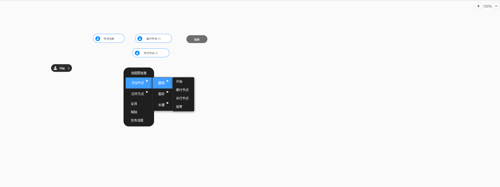

# Dify流程图仿制



基于 Vue + jsPlumb 的流程图设计器，支持节点拖拽、连线、属性配置等功能。所有操作均通过**画布右键菜单**完成。

---

## 画布右键菜单配置说明

本文档说明 `flow-config.js` 中 `contextMenu.container.menulists`（约第 185-286 行）的作用，即画布空白处右键时弹出的菜单项及其功能。

### 菜单结构概览

```
流程图信息
预览
工具
  ├── 拖拽
  └── 连线
显示/隐藏网格
查看JSON
重新绘制
添加节点
  ├── 基础
  │   ├── 开始
  │   ├── 普通节点
  │   ├── 审批节点
  │   ├── API节点
  │   ├── 分派节点
  │   ├── 确认节点
  │   └── 结束
  ├── 高级
  │   ├── 虚拟节点
  │   ├── 节点任务
  │   └── 子流程
  └── 泳道
      ├── 横向泳道
      └── 纵向泳道
对齐方式
  ├── 垂直左对齐
  ├── 垂直居中
  ├── 垂直右对齐
  ├── 水平上对齐
  ├── 水平居中
  └── 水平下对齐
全选
粘贴
发布流程
快捷键
```

---

## 一、操作类菜单项

### 1. 流程图信息 (flowInfo)

显示当前流程图的节点数量、连线数量。

### 2. 预览 (previewFlow)

预览并导出当前流程图为 PNG 图片。

### 3. 工具 (children)

| 菜单项 | fnHandler | 说明 |
|--------|-----------|------|
| 拖拽 | selectToolDrag | 切换到拖拽模式，可移动节点 |
| 连线 | selectToolConnection | 切换到连线模式，可在节点间创建连线 |

### 4. 显示/隐藏网格 (toggleShowGrid)

切换画布网格背景的显示与隐藏。

### 5. 查看JSON (openViewJson)

打开当前流程图的数据 JSON，支持查看与加载。

### 6. 重新绘制 (clear)

清空画布所有节点与连线，需确认后执行。

---

## 二、添加节点 (children)

在右键点击位置添加各类流程节点。

### 2.1 基础节点

| 节点类型 | fnHandler | 说明 |
|---------|-----------|------|
| 开始 | addNodeStart | 流程起始节点，每个流程有且仅有一个 |
| 普通节点 | addNodeOrdinary | 通用流程节点 |
| 审批节点 | addNodeApproval | 审批类节点 |
| API节点 | addNodeApi | 调用外部 API 的节点 |
| 分派节点 | addNodeDispatch | 任务分派节点 |
| 确认节点 | addNodeConfirmation | 确认类节点 |
| 结束 | addNodeEnd | 流程终止节点 |

### 2.2 高级节点

| 节点类型 | fnHandler | 说明 |
|---------|-----------|------|
| 虚拟节点 | addNodeVirtual | 不产生实际任务，用于流程结构控制（如条件分支汇聚） |
| 节点任务 | addNodeJob | 挂载在普通/审批等节点上的具体任务，可配置办理人、角色等 |
| 子流程 | addNodeChildFlow | 调用另一流程作为子流程，实现流程嵌套 |

### 2.3 泳道

| 节点类型 | fnHandler | 说明 |
|---------|-----------|------|
| 横向泳道 | addNodeXLane | 水平方向的泳道容器 |
| 纵向泳道 | addNodeYLane | 垂直方向的泳道容器 |

---

## 三、对齐方式 (children)

对已选中的多个节点进行排列。需先多选节点（Ctrl + 鼠标框选）后再使用。

| 菜单项 | fnHandler | 说明 |
|--------|-----------|------|
| 垂直左对齐 | verticaLeft | 纵向排列，左边缘对齐 |
| 垂直居中 | verticalCenter | 纵向排列，垂直居中 |
| 垂直右对齐 | verticalRight | 纵向排列，右边缘对齐 |
| 水平上对齐 | levelUp | 横向排列，上边缘对齐 |
| 水平居中 | levelCenter | 横向排列，水平居中 |
| 水平下对齐 | levelDown | 横向排列，下边缘对齐 |

---

## 四、其他菜单项

| 菜单项 | fnHandler | 说明 |
|--------|-----------|------|
| 全选 | selectAll | 选中画布上所有节点 |
| 粘贴 | paste | 粘贴之前复制的节点 |
| 发布流程 | publishFlow | 将当前流程图发布保存到后端 |
| 快捷键 | shortcutHelper | 打开快捷键说明弹窗 |

---

## 五、节点与连线右键菜单

- **节点右键**：设置属性、复制节点、删除节点
- **连线右键**：设置属性（类型、颜色、粗细、条件等）、删除连线
- **点击连线**：弹出属性配置抽屉，可配置连线样式与条件

---

## 六、配置字段说明

| 字段 | 说明 |
|------|------|
| btnName | 菜单显示名称 |
| fnHandler | 点击后调用的方法名，需在 `flow-area.vue` 中实现并 emit |
| icoName | 菜单项左侧图标（Ant Design Icons） |
| children | 子菜单列表，存在则显示为子菜单 |
| disabled | 是否禁用 |

---

## 七、默认流程

首次进入时自动加载默认流程：**开始** → **提单节点** → **确认节点** → **结束**，垂直布局，直线连接。

---

## 八、相关文件

| 文件 | 说明 |
|------|------|
| `src/config/flow-config.js` | 菜单配置、流程默认配置 |
| `src/config/node-config.js` | 节点模板与默认属性 |
| `src/config/type.js` | 节点类型常量 |
| `src/components/flow-area.vue` | 画布组件、菜单事件处理 |
| `src/components/flow-attr.vue` | 节点/连线属性配置面板 |
| `src/views/flow-design.vue` | 流程设计主页面 |
